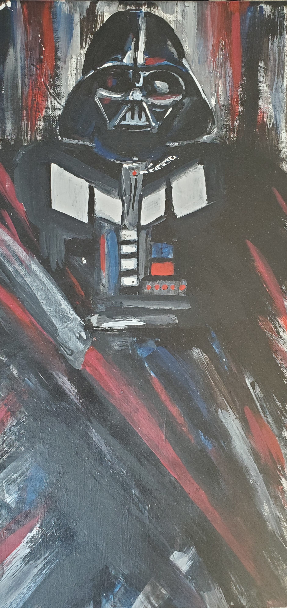
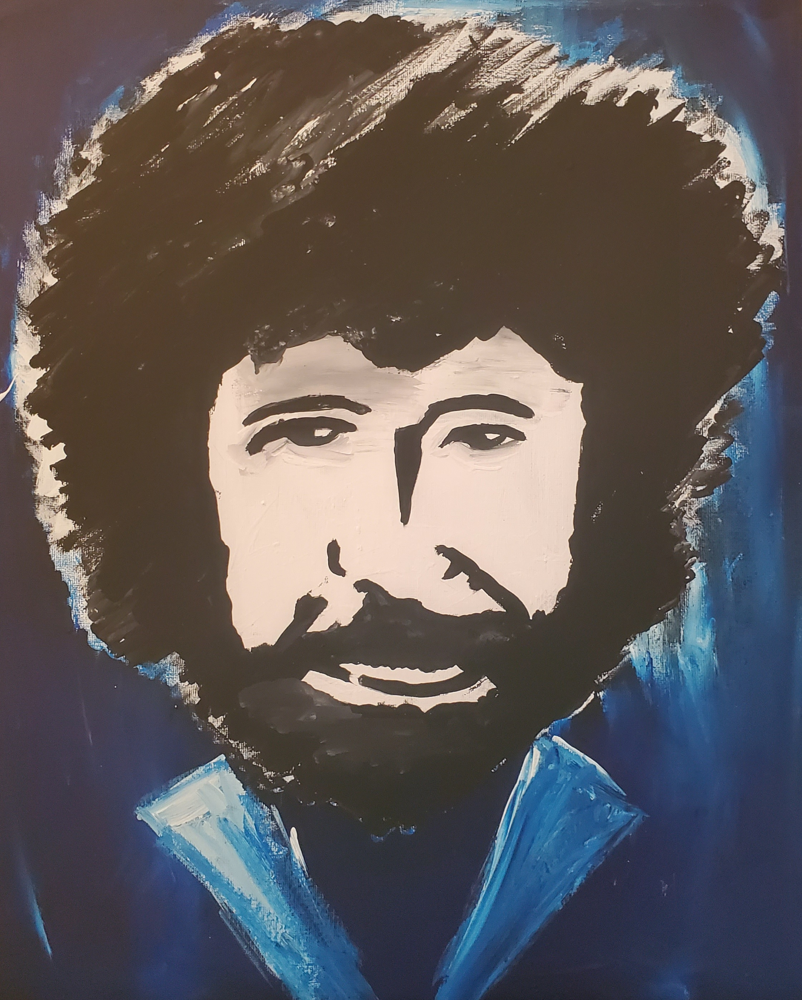
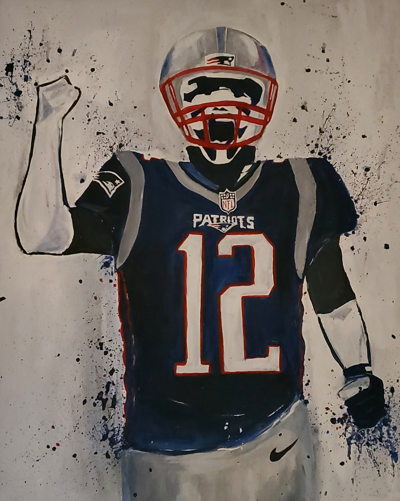
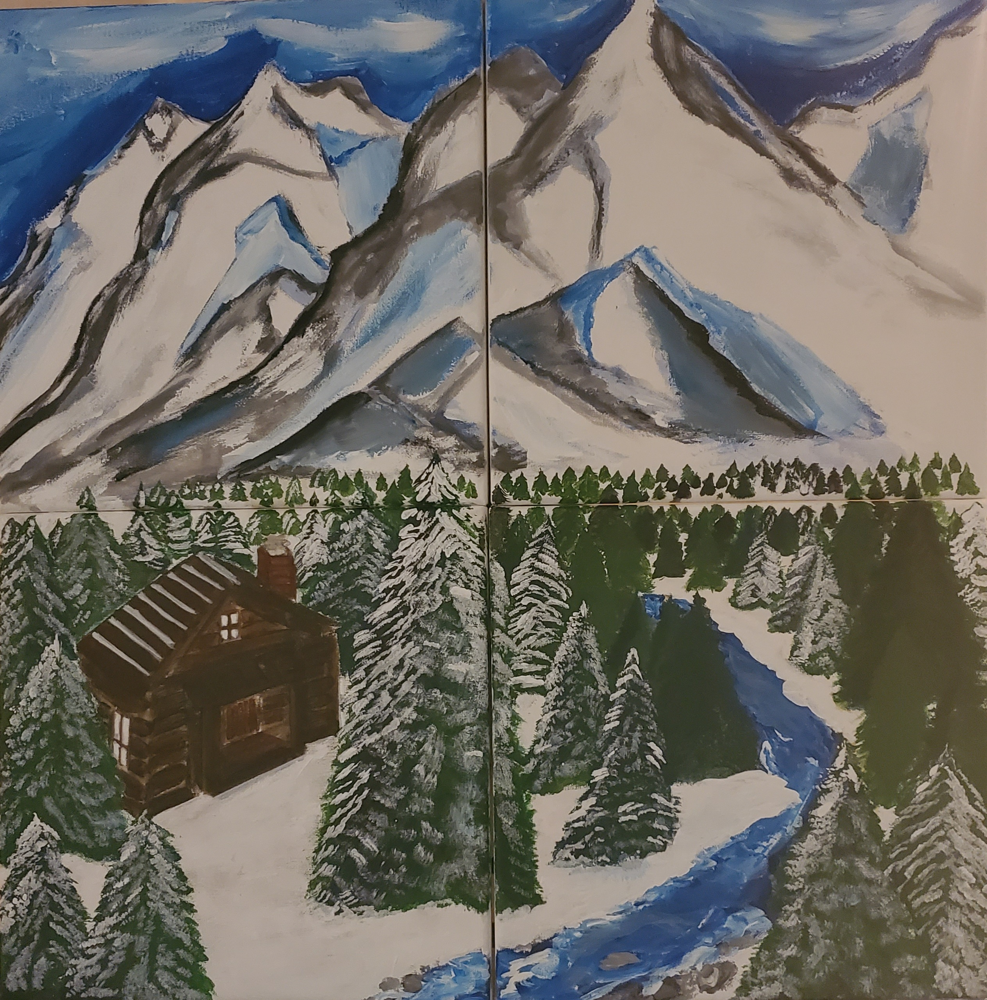
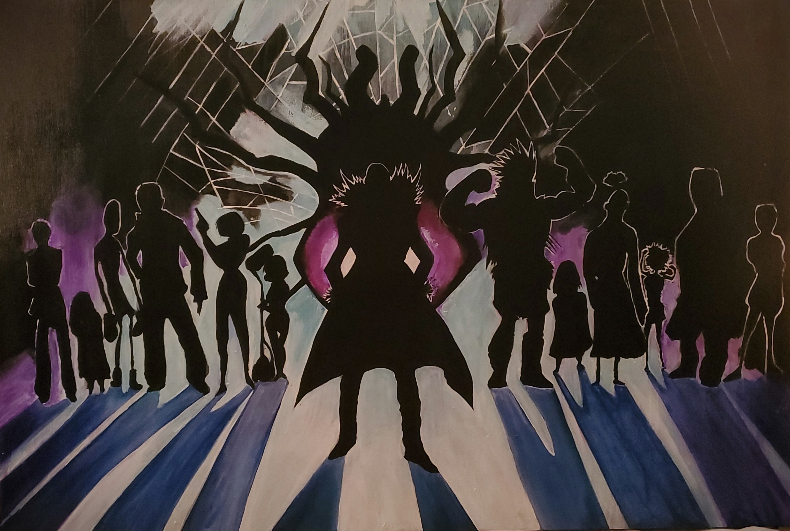

<html>
<head>
<meta name="viewport" content="width=device-width, initial-scale=1">
<link href="./markdown.css" rel="stylesheet">

</head>
<body>

<!-- MAIN (Center website) -->

<body>
<h1> Student Portfolio </h1>
  <h2> Site Navigation </h2>
<nav>
    <ul>
      <li><a href="https://mswartze-creator.github.io/Hobbies/">Artwork</a>
      <li><a href="https://mswartze-creator.github.io/Student-Life/">Meet the Artist</a>
      <li><a href="https://mswartze-creator.github.io/Volunteer-Work/">Contact</a>
      <li><a href="https://mswartze-creator.github.io/Student-Portfolio/">Landing Page</a>
      
   <h1>Hobbies</h1>

<h2>Artwork</h2>

 In my free time, I paint quite a bit! I've been working on commissioned artwork for the past three years. A few examples of this artwork are provided below!

<!-- Portfolio Gallery Grid -->

  <figure class="gallery__item gallery__item--1">
 
      <h3>Captain America</h3>
      
Captain America, Acrylic, 2017.

  </figure>
  <figure class="gallery__item gallery__item--2">
    
      <h3>Darth Vader</h3>
      
Darth Vader, Acrylic, 2017.

  </figure>
  <figure class="gallery__item gallery__item--3">
    
      <h3>Speed Paint</h3>
      
Bob Ross Speed Paint completed in 2.5 minutes during talent show! It currently resides on my friends' livingroom ceiling. 2020

  </figure>
  <figure class="gallery__item gallery__item--4">
    
      <h3>Tom Brady</h3>
      
Commissioned pop art portrait of Tom Brady, 2019

  </figure>
  <figure class="gallery__item gallery__item--5">
    
      <h3>Mountains</h3>
      
Commissioned four-part painting of the Alaskan Mountain Range, Acrylic, 2020

  </figure>
  <figure class="gallery__item gallery__item--6">
   
      <h3>Shadow Team</h3>
      
Commissioned 3 by 4 foot piece, Acrylic, 2019

  </figure>
    
    

<!-- END GRID -->

<!-- END MAIN -->

<footer> <h6> Copyright: George Mason University </h6><footer>
